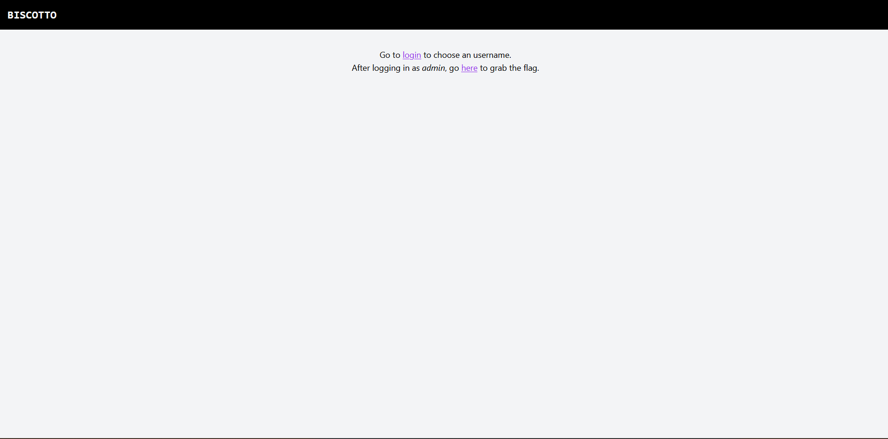

# Description
Elia accidentally locked himself out of his admin panel can you help him to get his access back?
https://biscotto.challs.pascalctf.it 

## Info

- Solved by [InSearchOfName](https://github.com/InSearchOfName)
- Written by [InSearchOfName](https://github.com/InSearchOfName)

## Solution

we are greeted with a site were we can login and go to another page to get the flag.

We also got source code in the code we can see that when we go to the site where the flag is it will only show if our user cookie is "Admin"
~~~js
app.get("/me", (req, res) => {
    const username = req.cookies.user;
    if (!username || username !== "admin") {
        res.send("<a href='/login'>Log in</a> as admin if you want the flag.");
    } else res.send(env.FLAG);
});
~~~

so we make a cookie in the browser with the Name 'user' and the Value 'admin'

now if we go to the flag page we see that there is a flag.
~~~
pascalCTF{d0n7_f0rg3t_th3_ch0col4t3}
~~~