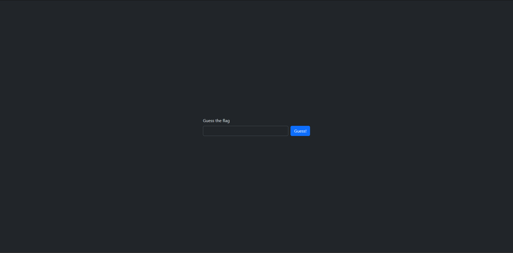

# Static Fl@g 
A friend of mine created a nice frontend, he said we didn't need a backend to check the flag...
https://staticflag.challs.pascalctf.it 

## Info

- Solved by [InSearchOfName](https://github.com/InSearchOfName)
- Written by [InSearchOfName](https://github.com/InSearchOfName)

## Solution

We are greeted with a page looking like this where we can guess the flag 

If we check out the html we find a script with the following code 

~~~js
    document.getElementById('submit').addEventListener('click', () => {
        const flag = document.getElementById('flag').value;
        if (flag === atob('cGFzY2FsQ1RGe1MwX3kwdV9jNG5fVVMzXzFuc3BlY3RfM2wzbTNudF90MF9jaDM0dF9odWg/fQ==')) {
            document.getElementById('winning').style.display = 'block';
            document.getElementById('losing').style.display = 'none';
        } else {
            document.getElementById('losing').style.display = 'block';
            document.getElementById('winning').style.display = 'none';
        }
    });
~~~

Now we see there is an atob function and a Base64 encoded string inside. if we decode this we get the flag

~~~bash
echo 'cGFzY2FsQ1RGe1MwX3kwdV9jNG5fVVMzXzFuc3BlY3RfM2wzbTNudF90MF9jaDM0dF9odWg/fQ==' | base64 -d
~~~

which returns `pascalCTF{S0_y0u_c4n_US3_1nspect_3l3m3nt_t0_ch34t_huh?`